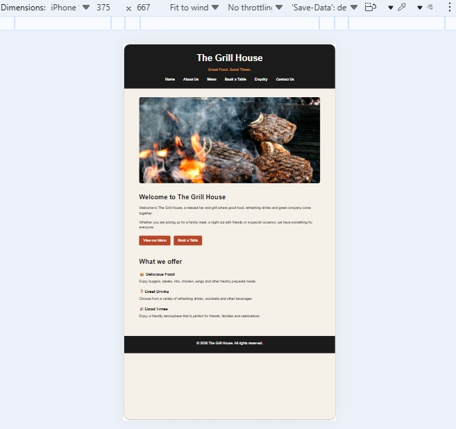
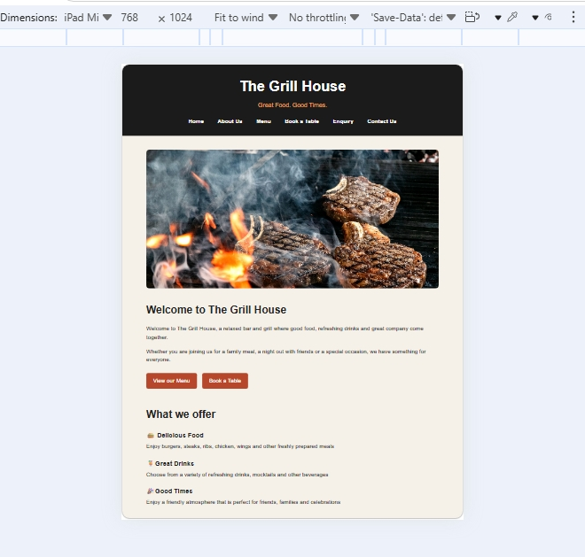
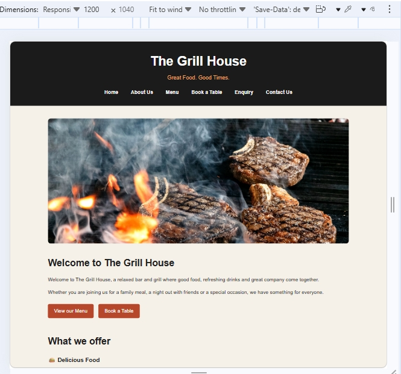

# The Grill House

## Student Information
Name: Chuma Molatlhwe
Student Number: ST10514926
Module: WEDE5020
Project: POE

## Project Overview
The Grill House is a bar and grill restaurant website developed for the WEDE5020 POE. The website provides customers with information about the restaurant, its menu, table bookings, enquiries and contact details.

## Website Goals and Objectives
- Create a simple and user-friendly restaurant website.
- Provide easy access to menu and restaurant information.
- Allow customers to submit table booking requests.
- Allow customers to send enquiries.
- Improve the restaurant's online presence.

## Key Features
- Home page
- About Us page
- Menu page
- Book a Table page
- Enquiry page
- Contact Us page
- Responsive and consistent website design
- Interactive booking and enquiry forms
- JavaScript confirmation messages

## Technologies Used
- HTML5
- CSS3
- JavaScript
- Git and GitHub

## Sitemap
Home
- About Us
- Menu
- Book a Table
- Enquiry
- Contact Us

## Project Timeline
- Week 1: Planning and research
- Week 2: Website design and wireframe
- Week 3: HTML development
- Week 4: CSS styling and JavaScript functionality
- Week 5: Testing, debugging and final submission

## Changelog
### Version 1.0
- Created the main website structure.
- Added six main website pages.
- Added website styling using CSS.
- Added navigation between pages.
- Added booking and enquiry forms.
- Added JavaScript confirmation messages.
- Added restaurant image and other visual elements.

### Version 2.0 - Part 2
- Improved website styling using CSS.
- Added Flexbox for navigation layout.
- Added responsive tablet and mobile breakpoints.
- Added relative units such as rem and percentages.
- Added focus and active states for interaction elements.
- Added responsive images using srcset and sizes.
- Tested the website on mobile, tablet and desktop screen sizes.
- Added responsive testing screenshots to the README.

## References
- Pexels – Restaurant image by Mohamed Olwy.
- MDN Web Docs – HTML, CSS, JavaScript and accessibility resources.
- Figma – Wireframing and website design guidance.

## Part 2 References
- MDN Web Docs - CSS Media Queries.
- MDN Web Docs - CSS Flexible Box Layout (Flexbox).
- MDN Web Docs - Responsive Images using srcset and sizes.

## Responsive Design Testing
The website was tested at different screen sizes to ensure that the layout, navigation, images and content display correctly on mobile, tablet and desktop devices.

### Mobile View

### Tablet View

### Desktop View

